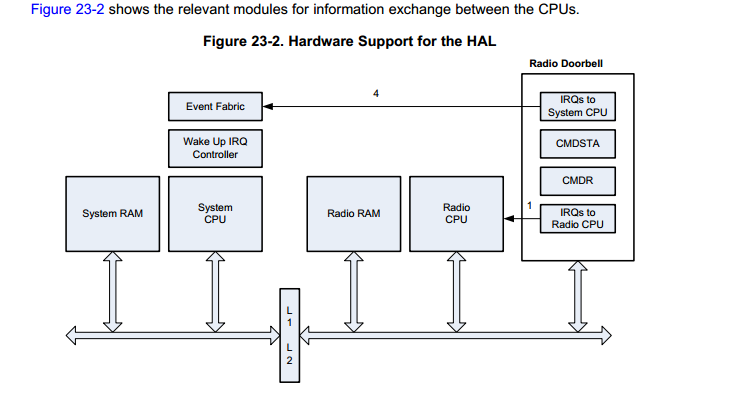

## 23.1 RF内核 ##
		RF内核包含一个连接模拟RF和基带电路的ARM Cortex-M0处理器处理来自或者发送给系统的侧的数据，在给定的数据包结构中装配信息位。这个RF内核提供一个高级别，基于命令的应用编程接口（API）到CPU（ARM Cortex-M3）,这个RF内核能够自动的处理射频协议中的时间方面的的部分（802.15.4 RF4CE和Zigbee,低功耗Bluetooth等等），因此，卸载系统的中央处理器，并为用户的应用程序留下更多的资源。 
		RF内核有一个专用的4-KB SRAM块和运行于单独的ROM。

### 23.1.1 高级别的描述和概览 ###
这个RF内核接收来自于系统CPU高级别的请求和运行所有它们之间必要的数据处理，这些请求基于来自于射频通道传输和接收到的信息，而且也包括额外的维修任务，比如校准，测试或调试功能。
作为一个通用的框架 ，系统CPU和RF内核之间的操作有一下几个方面：

	- 这个RF内核能够从系统RAM里面访问数据和配置参数， 这减少了RF内核的内存需求，避免了系统不同部分的不必要的通信和减少了这个能量的损耗;
	- 用相似的方式，这个RF内核能够解码和写回接收到的射频数据包的内容，全部的状态信息，放到系统内存之中；
	- 基于协议的保密性和认证支持的目的这个射频内核也可以访问安全子系统；
	- 总的来说，这个RF内核识别来自于系统CPU（CCA传输，自动应答等等）的复杂命令，进一步的从子命令中分离它们而不需要系统CPU的进一步的干预；

	
- 系统侧：
	- 系统CPU：运行用户运用的主系统处理器，和高级别的协议堆栈在一起（为了支持一定数量的配置），和最终一些高级别的MAC协议特性，这个系统CPU运行来自于启动ROM和系统闪存的代码；
	- 系统RAM：包含数据包信息（TX和RX载荷）和为了一个给定的事务的不同的属性参数和配置选项；
	- 安全子系统：包含不同的元素，以提供协议保密性和认证；
	- DMA：可选地将从无线内存中的信息移动到系统内存中,反之亦然，如果不使用直接的中央处理器访问；

- 射频侧：
	- 射频CPU：主RF内核处理器，接收来自于系统CPU的高级别的命令和调度RF内核不同部分；
	- 调制解调器，频率合成器，射频接口 ：这是射频的核心部分，将比特位转换为调制信号，反之亦然；

## 无线门铃 ##

无线门铃模块（RFC_DBELL）是系统CPU和无线CPU最基本的通信手段，也叫做命令和数据包引擎（CPE），这个无线门铃包括设备中的任何RAMs中的专用寄存器和属性参数集合和系统CPU和无线CPU的中断集合。
而外的，参数好和载荷通过系统RAM和无线RAM进行传输，如果是在系统RAM中的任何参数和载荷，则系统CPU必须保持电能，当所有的参数都在无线RAM中的时候，这系统CPU就可以进入掉电模式来保存电能。
运行期间，无线CPU在RAM中更新参数和载荷和抛出中断，系统CPU可以屏蔽中断，以至于它能保持空闲和掉电模式直到整个无线操作运行完毕。
因为系统CPU和无线CPU共享一个公用的RAM区域，确保没用竞争和比赛的情况发生，这是通过无线硬件抽象层（HAL）基于设定的规则用软件来实现的。

